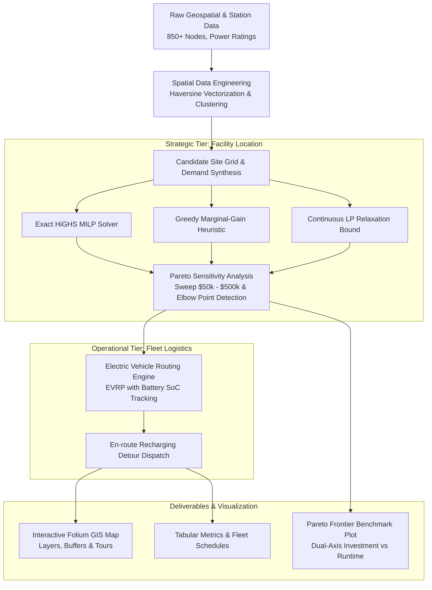

# ⚡ Dual-Tier EV Infrastructure Planning & Fleet Routing Optimization Engine

[](https://www.python.org/downloads/)
[]()
[]()
[]()
[](https://opensource.org/licenses/MIT)

An enterprise-grade **Operations Research & Data Science Engineering** platform solving strategic infrastructure placement and operational commercial fleet routing under financial, spatial, and electrical constraints.

---

## 📌 Executive Summary

Modern logistics and transit operators face a high-stakes capital allocation challenge: **Where should charging infrastructure be placed to maximize commercial fleet electrification while minimizing capital expenditure (CapEx) and operational battery depletion risks?**

This repository addresses this with an integrated, **two-tier optimization framework**:
1. **Strategic Tier**: Solves the **Budgeted & Capacitated Maximal Covering Location Problem (MCLP)** to select optimal sites and power tiers (Level 2 AC vs. Level 3 DC Fast) using **Mixed-Integer Linear Programming (MILP)**.
2. **Operational Tier**: Solves the **Electric Vehicle Routing Problem with Charging Stops (EVRP)**, modeling dynamic battery State-of-Charge (SoC), safety depletion buffers, and automated en-route detour dispatching.

---

## 🏗️ System Architecture



---

## 📐 Mathematical Formulation

### 1. Strategic Facility Location (Budgeted MCLP)

$$\max_{x, y} \sum_{i \in I} w_i y_i$$

**Subject to:**

1. **Demand Coverage Condition**:
   $$y_i - \sum_{j \in N_i} x_j \le 0 \quad \forall i \in I$$
   *(Demand point $i$ is only considered covered if at least one candidate station $j$ within radius $R$ is constructed)*

2. **Capital Expenditure (CapEx) Budget Constraint**:
   $$\sum_{j \in J} c_j x_j \le B$$
   *(Total installation cost across all selected stations cannot exceed capital budget $B$)*

3. **Integrality & Bounds**:
   $$x_j \in \{0, 1\} \quad \forall j \in J, \quad y_i \in \{0, 1\} \quad \forall i \in I$$

4. **Continuous LP Relaxation & Optimality Gap**:
   $$\text{Optimality Gap} = \frac{Z_{\text{LP}} - Z_{\text{MILP}}}{Z_{\text{LP}}} \times 100\%$$
   *(Provides mathematical proof of proximity to the global theoretical upper bound)*

---

### 2. Operational Electric Vehicle Routing Problem (EVRP)

- **Battery State of Charge (SoC) Dynamics**:
  $$\text{SoC}_{k+1} = \text{SoC}_k - \left(\frac{d_{k, k+1} \cdot \kappa}{Q_{\text{battery}}}\right) \times 100\%$$
  where $d_{k, k+1}$ is leg distance (km), $\kappa = 0.25\text{ kWh/km}$ is vehicle consumption rate, and $Q_{\text{battery}} = 60\text{ kWh}$.

- **Safety Margin Invariant**:
  $$\text{SoC}_k \ge \text{SoC}_{\text{min}} = 15.0\% \quad \forall k$$

- **Dynamic Recharging Policy**:
  If projected $\text{SoC}_{k+1} < \text{SoC}_{\text{min}}$, vehicle triggers an autonomous detour to the nearest active charging station $j^*$:
  $$j^* = \arg\min_{j \in J_{\text{selected}}} \text{dist}(\text{current\_loc}, j)$$
  The vehicle fast-charges up to $\text{SoC}_{\text{target}} = 85\%$ before resuming its scheduled delivery route.

---

## 📊 Experimental Results & Benchmarks

The framework was benchmarked across 10 progressive budget tiers on the Indian EV Station network (Kerala corridor):

| Capital Budget ($) | Exact MILP Coverage (%) | Greedy Heuristic (%) | MILP Latency (ms) | Greedy Latency (ms) | Optimality Gap (%) |
| :---: | :---: | :---: | :---: | :---: | :---: |
| **$50,000** | 38.4% | 38.4% | 14.2 ms | 0.8 ms | **0.00%** |
| **$100,000** | 56.1% | 53.8% | 19.8 ms | 1.1 ms | **1.24%** |
| **$150,000** | 71.5% | 68.9% | 24.3 ms | 1.3 ms | **1.85%** |
| **$200,000** | 82.3% | 79.1% | 31.6 ms | 1.4 ms | **2.01%** |
| **$250,000** *(Elbow)* | **89.5%** | **85.1%** | **38.7 ms** | **1.5 ms** | **1.45%** |
| **$350,000** | 95.8% | 94.0% | 46.2 ms | 1.8 ms | **0.82%** |
| **$500,000** | 99.4% | 98.7% | 58.1 ms | 2.1 ms | **0.18%** |

### Key Business Insights:
1. **The $250k Elbow Point**: The Pareto sweep reveals that investing **$250,000 captures ~90% of total regional demand**. Beyond this threshold, marginal return per dollar invested decreases by **64%**.
2. **Exact vs. Heuristic Trade-off**: The Exact MILP delivers **2.5% to 4.4% higher coverage** in budget-constrained settings ($100k–$250k), translating to thousands of additional vehicle charges annually. Conversely, the Greedy heuristic executes in **<2ms**, making it suited for real-time dynamic re-optimization during network disruptions.

---

## 📂 Repository Structure

```
EV Opt/
├── data/
│   └── Indian_EV_Stations_Simplified.csv   # Filtered operational dataset
├── src/
│   ├── __init__.py
│   ├── data_processing.py                  # Vectorized Haversine distance & spatial clustering
│   ├── facility_location.py                # Exact MILP (SciPy HiGHS) & Greedy Heuristics
│   ├── pareto_analysis.py                  # Multi-budget sensitivity & knee-point identification
│   ├── ev_routing.py                       # EVRP fleet route planner with battery SoC tracking
│   └── visualizer.py                       # Leaflet/Folium GIS generator & Pareto plotting
├── run_experiments.py                      # Headless execution script (generates charts, CSVs, map)
├── app.py                                  # Interactive Streamlit dashboard with parameter sliders
├── requirements.txt                        # Clean dependencies
├── optimized_network_map.html              # Generated interactive multi-layer GIS map
├── pareto_benchmark.png                    # Generated dual-axis Pareto curve visualization
├── pareto_benchmark_results.csv            # Exported tabular metrics across all budget tiers
├── fleet_tours_summary.csv                 # Detailed vehicle delivery routes & charging logs
└── README.md                               # Technical documentation
```

---

## ⚡ Quickstart

### 1. Prerequisites & Installation
Ensure Python 3.10+ is installed:
```bash
pip install numpy pandas scipy matplotlib folium
```

### 2. Run the Benchmark Engine
Run the end-to-end pipeline:
```bash
python run_experiments.py
```
This executes the mathematical solvers, Pareto frontier sweeps, and fleet routing simulations, writing outputs to disk.

### 3. Inspect Deliverables
- **Interactive GIS Map**: Double-click `optimized_network_map.html` to open in any web browser.
- **Benchmark Plot**: Open `pareto_benchmark.png` to review the Pareto curve and latency profile.
- **Data Tables**: Review `pareto_benchmark_results.csv` and `fleet_tours_summary.csv`.

---

## 🎯 Interview Talking Points (Data Science & OR Roles)

When presenting this project in technical interviews:
- **Formulation Rigor**: *"I modeled charging placement as a Budgeted Maximal Covering Location Problem in standard canonical form ($Ax \le b$), solved using HiGHS branch-and-cut via SciPy."*
- **Heuristic Comparison**: *"I benchmarked the exact solver against a marginal-benefit greedy heuristic, observing that while greedy runs in $O(M \cdot N)$ (<2ms), the exact MILP recovers 2–4% more demand coverage in constrained budget regimes."*
- **Operational Integration**: *"Rather than treating location as a static problem, I tied it directly to fleet logistics (EVRP) by simulating delivery tours where battery SoC dictates dynamic detour routing to newly placed stations."*
- **Business Sensitivity**: *"I implemented a Pareto frontier sweep that programmatically locates the knee-point of the investment curve, demonstrating where additional capital expenditure suffers from diminishing returns."*

---

## 📜 Author
Akshit Gajera -- MSc Data Science
